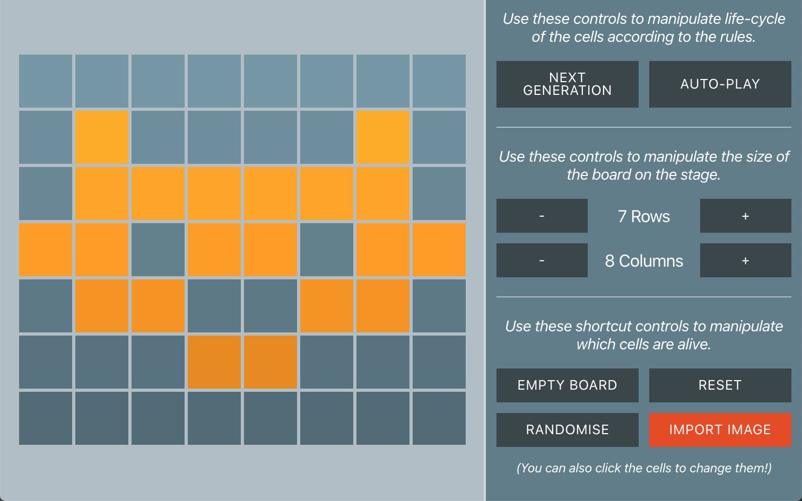

# Cell Simulator

This is an interactive Cellular Automata game. Unlike the standard [Conway's
Game of Life](https://en.wikipedia.org/wiki/Conway%27s_Game_of_Life) where the
cells are affected by their 8 nearest neighbors, this version is more similar to
the [von Neumann Automata](https://en.wikipedia.org/wiki/Von_Neumann_cellular_automaton)
where the cells only care about their cardinal neighbors -- those to the North,
East, West and South.

|  |
| :-----------------------------------------: |
|         _A screenshot of the game_          |

[Try the live version on Netlify →](https://angry-minsky-e2796d.netlify.com/)

This project was bootstrapped with [Create React App](https://github.com/facebook/create-react-app).

## Features

This app does many things including:

- Animated cellular automata
- Stepwise or automatic playback
- Ability to share current game state via URL
- Resizable game board
- Powerful game board seeding tools (eg: randomise)
- Import an image to use as the initial game state
- Works on big screens, tablets and even mobile-sized devices!
- A thoughtful fallback message for users with Javascript disabled

## Roadmap

There are still many things to do before this app would be production ready.
Here's some things that should be improved further:

- [ ] More comprehensive tests
- [ ] More reliable history navigation (back/forward buttons sometimes break the app)
- [ ] Better responsive design for Image Importer

## Developing

In the project directory, you can run:

### `yarn start`

Runs the app in the development mode. 
Open [http://localhost:3000](http://localhost:3000) to view it in the browser.

### `yarn test`

Launches the test runner in the interactive watch mode. 
See the section about [running tests](https://facebook.github.io/create-react-app/docs/running-tests) for more information.
